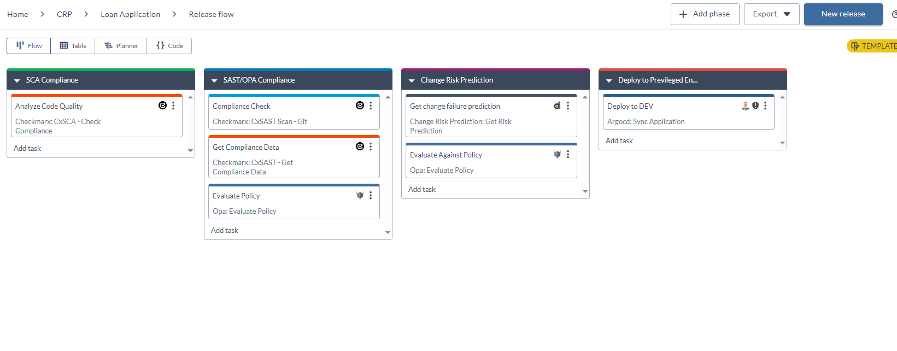
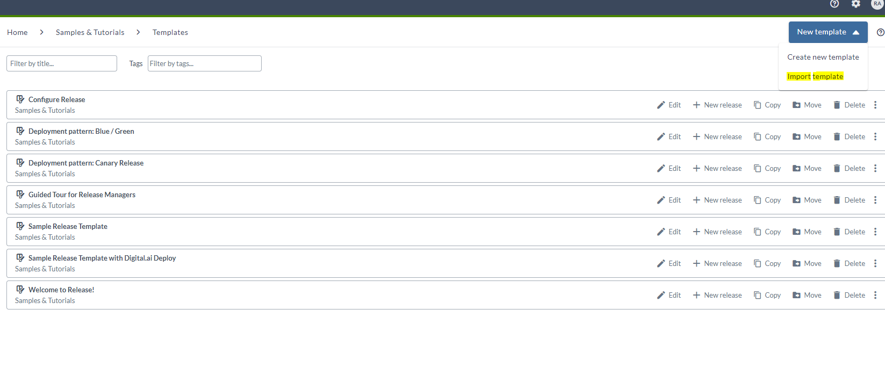
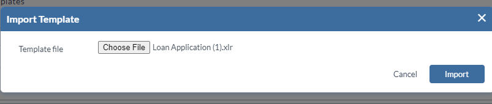
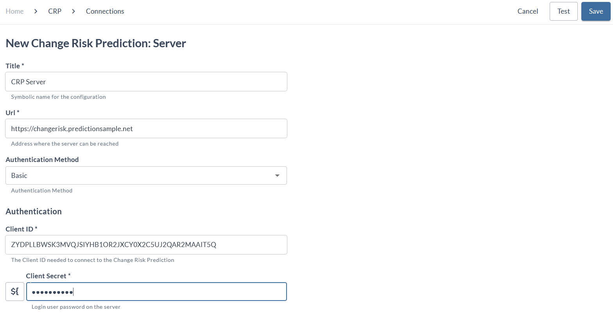
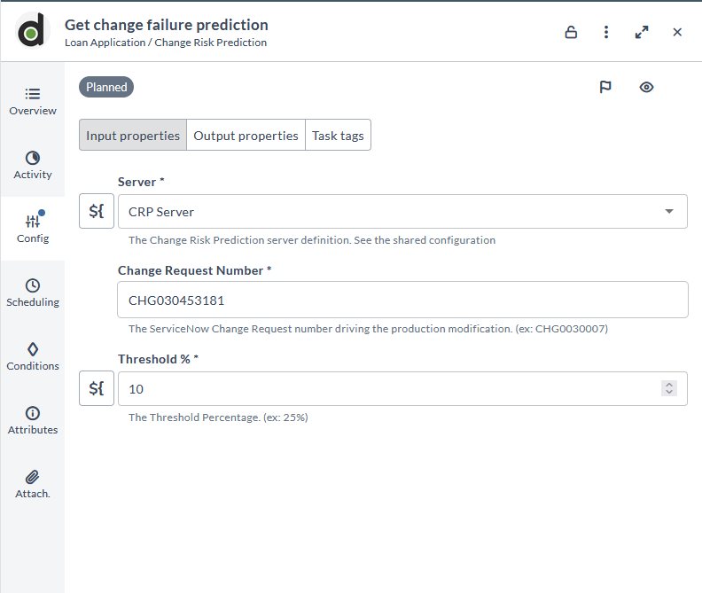
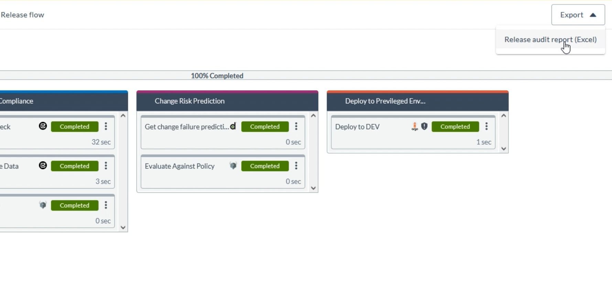
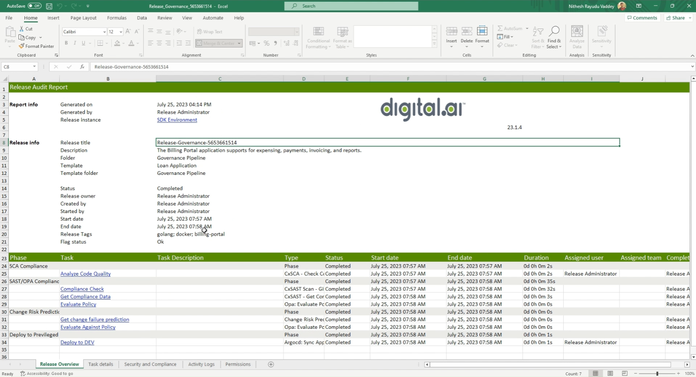

# Predictive Intelligence using Digital.ai Release and Change Risk Prediction Integration.

Use the Release Template for validating Predictive Intelligence using Digital.ai Release and Change Risk Prediction Integration.

## Before you begin

This how-to involves working with a variety of tools and technologies such as Digital.ai Release, Digital.ai Change risk Prediction Application, Checkmarx and Checkmarx SCA, OPA and ArgoCD. You can perform this task by simply following the instructions. However, being familiar with these tools and technologies can help you considerably when you try this out in your test environment.

## What's the objective?
The objective is to set up an automated release and deployment pipeline—a pipeline of tools such as OPA, Change Risk Prediction Application, Checkmarx, and have your application deployed using ArgoCd sync based on policy checks against Changes and Risk Prediction and other security data.

Once you have this setup in place, all you would be doing is to push a code change to trigger the task in the automated release, evaluate the Checkmarx SCa for static code analysis check, then Check with Checkmarx SAST scan output with  predefined OPA policy, Next phase the Change risk prediction is defined with the percentage of change expected, based on this output, we will validate it against the OPA policy, based on the policy check the deployment can be initiated using ArgoCd Sync.

## What do you need?
* A Linux or Windows server (with root and Internet access) that has both Change Risk Prediction Application (requires license for Change Risk Prediction Application software) and Release version 23.1.0 (or later) installed
* OPA plugin for Digital.ai Release (installed by default when you install Release)
* An OPA server running on local or remote host.
* A Checkmarx server running on local or remote host.
* A Checkmarx SCA setup up and running.
* An ArgoCd server running on local or remote host.
* A GitHub Actions/Jenkins Job with Automated Release Trigger enabled.

## What do you have?

* A [xebialabs-community/howto](https://github.com/xebialabs-community/howto) GitHub repository that hosts the template and can be used to import the required templates.

## How does it work?



Here's a detailed step-by-step.

## Step 1 — Import the Release Template

In Digital.ai Release,

1. Create a new folder.
2. From within the folder, in the right top corner, select **New Template**.



3. Click **Import Template**.
The **Import Template**.  settings screen opens.
4. Select the required **XLR** template file, click on the **Import**, This should create a template with required phases and tasks.



## Step 2 — Create Required Connections/Servers.

1. From within the folder, in the left navigation pane, select **Connections**.
2. Create Connections for Checkmarx and Checkmarx SCA servers.

[Connection Creation Documentation Link For Checkmarx](https://docs.digital.ai/bundle/devops-release-version-v.23.1/page/release/how-to/using-the-checkmarx-plugin.html)

3. Create Connection for OPA server.

[Connection Creation Documentation Link For OPA](https://docs.digital.ai/bundle/devops-release-version-v.23.1/page/release/how-to/opa-plugin.html)

4. Create Connection for ArgoCd server.

[Connection Creation Documentation Link For ArgoCD](https://docs.digital.ai/bundle/devops-release-version-v.22.3/page/release/how-to/argocd-plugin.html)

5. Create Connection for CRP server.
 
### Steps to Create Connection for CRP server.
1. In the **Title** field, add the name for CRP server.
2. In the **URL** field, enter the CRP application URL.
3. In the **Authentication Method** field, select the Basic type.
4. In the **Client Id** field, enter the Client Id.
5. In the **Client Secret** field, enter the Client Secret.



6. Click the **Save** button, once required fields are added.

## Step 3 — Create Automated Task in Github Actions or Jenkins Jobs to Trigger Based on Job Completion.

1. In the GitHub actions update the manifest for githubactions to trigger automated release on code push.
**Path**: **<Repository>/.github/workflows/manifest.yml**
2. 
 ``` run: |
        run_id=${{ github.run_id }}
        echo "::set-output name=run_id::$run_id"
        echo ${{github.run_id}}
        curl --request POST -u 'admin:admin' --header 'content-type: application/json' --url 'http://111.111.111.111:5516/api/v1/templates/Applications/Folder59347dbf86ec4fb9ba7fa8822c855955/Release995328f6d3b6479993e8ed570b540b05/start' -d '{"releaseTitle":"Release-IOS-AndroidAppProtectionTest-${{github.run_id}}", "releaseVariables": {"REPO_NAME": "AndroidAppProtectionTest","WORKFLOWID": "${{github.run_id}}"}}'    
 ``` 
2. Similar automation can be created on the Jenkins job with the curl command that is similar to the one above.

## How to run the template?

1. Push the changes to the Github repository where we have added the above actions.
2. The Action Should Trigger the Release which contains the phases and tasks.
3. The initial phase checks for "SCA Compliance".
4. The Secondary Phase checks the "SAST/OPA Compliance" - The SAST scan is run in Checkmarks and the output is validated against a OPA policy.

#### OPA Policy for Checkmarx check.
 ``` 
package checkmarxprotection
allow {
    input.lowSeverity <= 10
    input.mediumSeverity <= 2
    input.highSeverity <= 0
}
 ```  

#### Input for Policy Evaluation for Checkmarx output.

 ``` 
 {
  "input": {
    "lowSeverity": 10,
    "mediumSeverity": 1,
    "highSeverity": 0
  }
}
 ```
5. The Third Phase checks the "Change Risk Prediction" - The ***Change Risk Prediction: Get Risk Prediction*** task output gets validated against a OPA policy.
6. The ***Change Risk Prediction: Get Risk Prediction*** required the following fields, ***Server*** , ***Change Request Number*** and ***Threshold %***.
   


#### OPA Policy for Change Risk Prediction.

 ``` 
package changeriskprediction
allow {
    input.riskScore <= 0.25
}
 ```  

#### Input for Policy Evaluation for Change Risk Prediction output.

 ``` 
 {
  "input": {
    "riskScore": "0.2345454554545"
  }
}
 ```

## How to check the Audit Reports?

1. To View the Audit Reports, Once the deployment is over, click on the ***Export*** , then click ***Release audit Report (Excel)***.



2. Exporting the reports , saves an Excel sheet.

