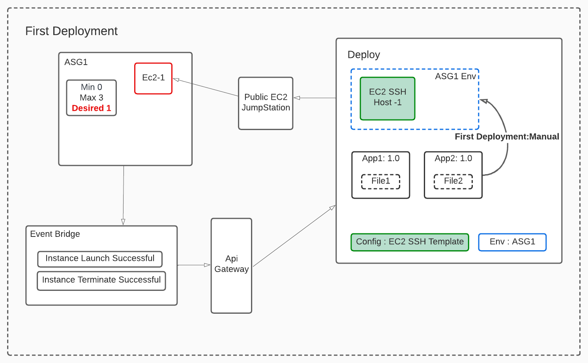

# Deployment to AWS AutoScalingGroups using Digital.ai Deploy (WIP)

Use Digital.ai Deploy to make deployments to AWS AutoScalingGroup Instances.
 EC2 instances in ASG are dynamic and with a private IP (no pulbic IP).

## How it Works

1. Use the exposed custom endpoint in Deploy (AWS plugin) to receive scaling notifications
2. Listen to ASG scaling events using Eventbridge and push to Deploy custom endpoint
3. Create SSH host equivalents in Deploy for EC2 instances created in ASG
4. Use a public EC2 instance as Bastion Host to push files to private ASG instances over SSH

## Initial Setup

1. Create ASG in AWS with intial Desired capacity as 0.
1. Create an EC2 instance in the public subnet with a public ip and capture the authentication details.
1. Setup AWS Cloud connection in Deploy as Infrastructure.
1. Configure the public EC2 instance as a overthere.SshJumpstation in Deploy Infra.
1. Create an Environment in Deploy in the same name of the ASG.
1. Create a Configuration object deploy.server and configure the url and authentication of the Deploy server
1. Create a Configuration object aws.asg.ec2SshHostTemplate with required information and dummy ip. 
1. All SSH instances created dynamically upon scaling will clone connection details from this configuration object.
1. Create API Gateway method with Http Endpoint as Deploy’s URL and authentication
1. Create an EventBridge rule in AWS to listen to Successful ASG EC2 Instance Launch and Terminations. Select the above created API as target

## First Deployment

1. Manually set the Desired capacity to a non zero value.
1. A new SSH Host should be created under Infrastructure in Deploy with Asg-InstanceId as the name.
1. This Host will have the private ip of the created EC2 instance.
1. Verify that this Host has also been added to the Environment with the Asg name.
1. Make deployments to the environment.
1. File transfers and command executions will happen through the Jumpstation over SSH

## Scale Up and Scale Down

1. On scale up, event bridge pushes notification to Deploy endpoint through API Gateway.
1. Deploy script creates an equivalent SSH Host with Jumpstation configuration
1. All current deployments to the environment (with ASG’s name) are identified and retriggered.
1. On scale down the terminated instance is removed from Infra and Environment

