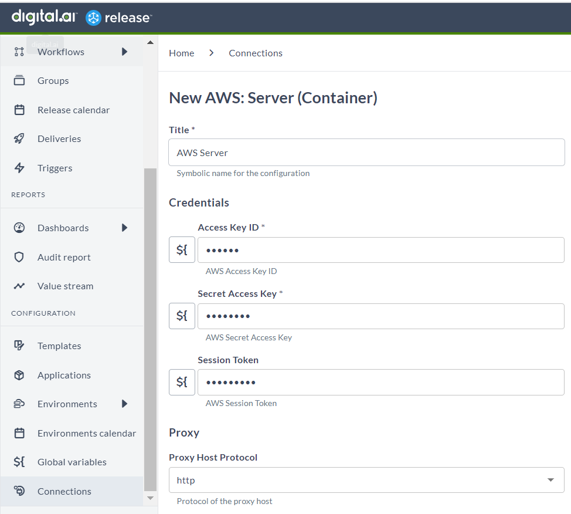
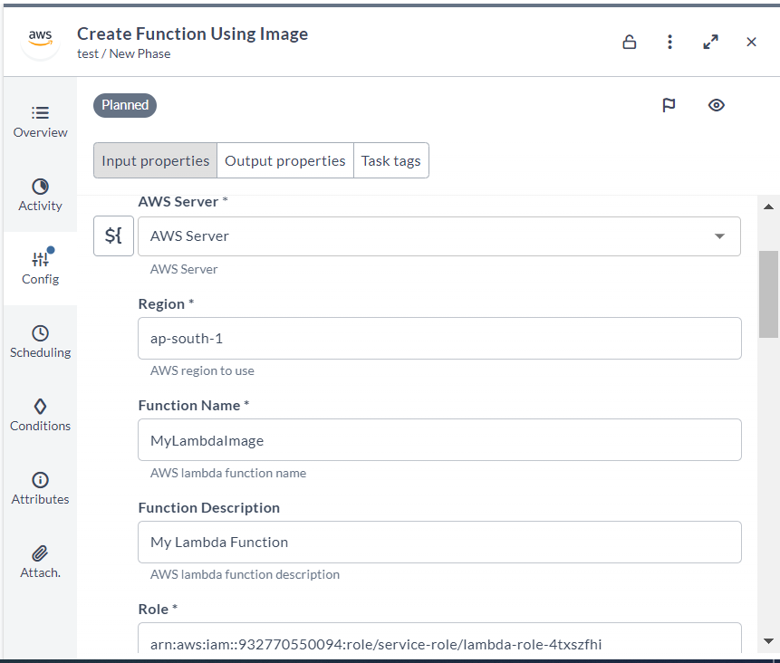
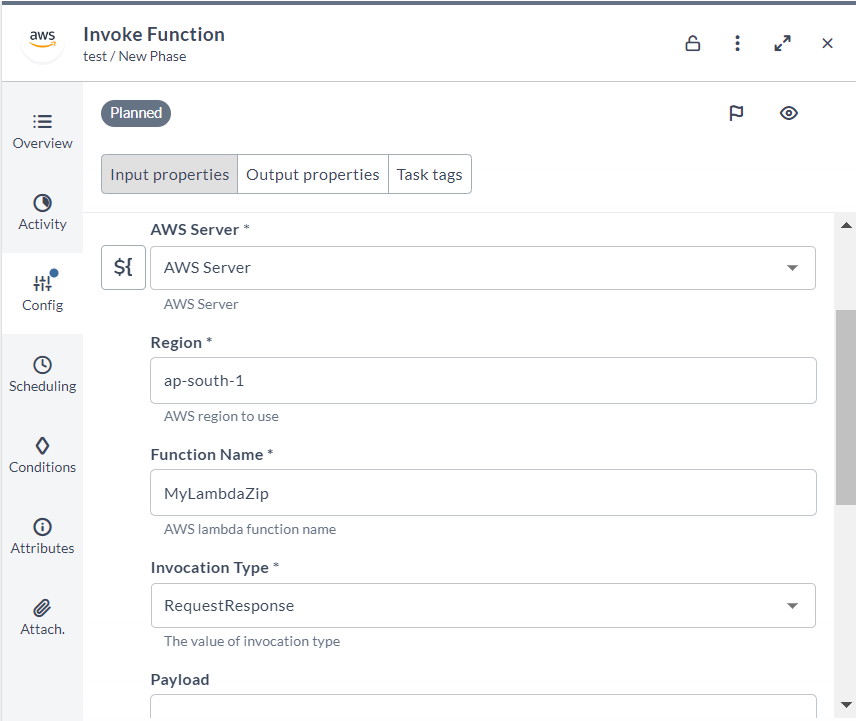

# release-aws-integration
It is container based integration for Digital.ai Release 

### Set up the AWS server

The connection accepts the following inputs:

1. **Title:** The name for the configuration.
2. **Access Key ID:** The value of AWS Access Key ID
3. **Secret Access Key:** The value of AWS Secret Access Key
4. **Session Token:** The value of AWS Session Token

### AWS: Create Function Using S3 Zip (Container)

This task creates an AWS Lambda Function using an S3 zip file.

It accepts the following inputs:

1. **Host:**  Select the AWS server connection.
2. **Region:** AWS region to use
3. **Function Name:** AWS lambda function name
4. **function Description:** AWS lambda function description
5. **S3 Bucket Name:** AWS S3 bucket name where the .zip file containing your deployment package is stored
6. **S3 Object Key:** path to your lambda-package.zip
7. **S3 Object Version:** The AWS S3 object (the deployment package) version
8. **Runtime:** The runtime environment for the Lambda. ex: python3.8
9. **Role:** The Amazon Resource Name (ARN) of the IAM role
10. **Handler:** The function within your code that Lambda calls to begin execution
11. **Wait:** For Active State: Wait until the function becomes active state
12. **Wait Interval:** Wait interval in seconds between tries
13. **Timeout:** Wait timeout in seconds
14. **Subnet Ids:** A list of VPC subnet IDs. Use a comma for separation
15. **Security GroupIds:** A list of VPC security group IDs. Use a comma for separation
16. **Memory Size:** The amount of memory, in MB, the Lambda function is given
17. **Environment:** The key-value pairs that are accessible from function code during execution
18. **Publish:** Set to true to publish the first version of the function during creation
19. **Tags:** The list of tags (key-value pairs) assigned to the new function

### AWS: Create an AWS Lambda Function using Image (Container)

This task creates an AWS Lambda Function using AWS Image.

It accepts the following inputs:

1. **Host:**  Select the AWS server connection.
2. **Region:** AWS region to use
3. **Function Name:** AWS lambda function name
4. **function Description:** AWS lambda function description
5. **Role:** The Amazon Resource Name (ARN) of the IAM role
6. **Image Uri:** URI of a container image in the Amazon ECR registry
7. **Wait:** For Active State: Wait until the function becomes active state
8. **Wait Interval:** Wait interval in seconds between tries
9. **Timeout:** Wait timeout in seconds
10. **Subnet Ids:** A list of VPC subnet IDs. Use a comma for separation
11. **Security GroupIds:** A list of VPC security group IDs. Use a comma for separation
12. **Environment:** The key-value pairs that are accessible from function code during execution
13. **Publish:** Set to true to publish the first version of the function during creation
14. **Tags:** The list of tags (key-value pairs) assigned to the new function

### AWS: Invoke Function (Container)

This task invoke an AWS Lambda Function.

It accepts the following inputs:

1. **Host:**  Select the AWS server connection.
2. **Region:** AWS region to use
3. **Function Name:** AWS lambda function name
4. **Invocation Type:** Select the invocation type
5. **Payload:** The JSON that you want to provide to your Lambda function as input
6. **Client Context:** The value of client context
7. **Qualifier:** Specify a version or alias to invoke a published version of the function

