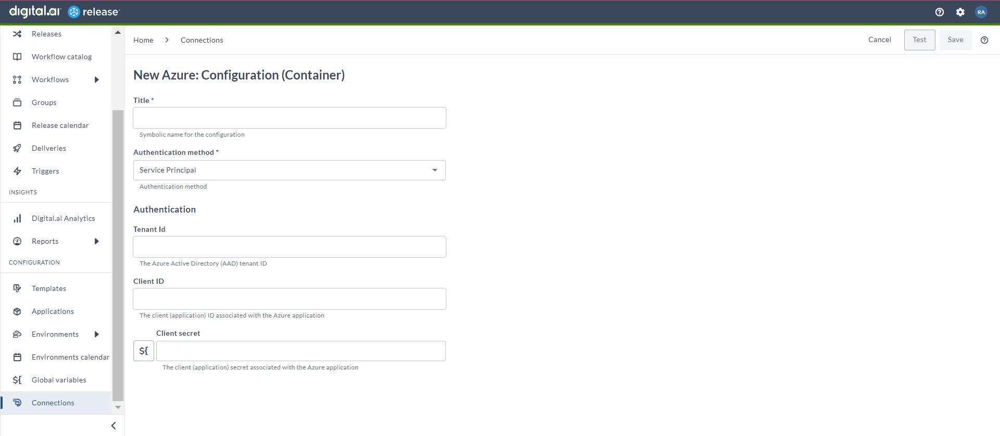
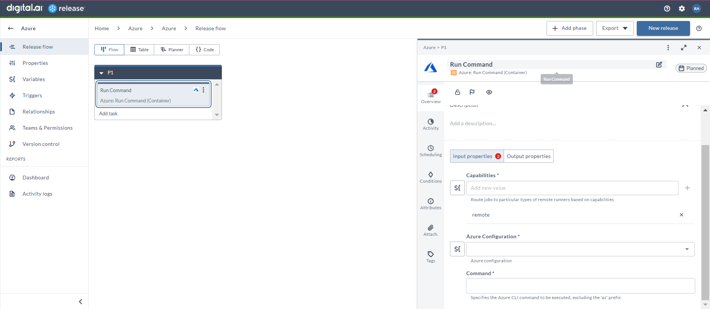

# Manage your Azure Services

### Before you begin
This how-to involves working with a variety of tools, such as Digital.ai Release and Azure. You can perform this task by following the instructions. However, being familiar with these tools and technologies can significantly help you when you try them out in your test environment.

### What's the objective?
The objective is to interact with Azure services or resources using Digital.ai Release.

### What do you need?
* A Linux or Windows server (with root and Internet access) that has Digital.ai Release version 24.1.0 (or later) installed
* Remote runner setup for Digital.ai Release
* Azure integration for Digital.ai Release

### What do you have?
* Azure environment and credentials

### How does it work?
* The Azure integration allows you to interact with the Azure services or resources in a more seamless and automated manner.

## Set up Azure Configuration

1. From the navigation pane, under **CONFIGURATION**, click **Connections**.
2. Under **HTTP Server connections**, next to **Azure Configuration (Container)**, click add button. 
The **New Azure: Configuration (Container)** page opens. 
1. In the **Title** field, enter the name of the configuration. 
This name will display in Azure tasks.
1. In the **Authentication method** field, select your relevant authentication type from the drop-down list.
* Server Principal
* User Principal
1. For **Server Principal***, you can enter **Tenant Id**, **Client ID**, and **Client secret**.
2. For **User Principal***, you can enter **Username** and **Password**.

## Run Command (Container)

The _Run Command (Container)_ task is to use the Azure CLI to run a command.

1. In the release flow tab of a Release template, add a task of type **Azure** > **Run Command (Container)**.
2. Click the added task to open it.
3. In the **Capabilities** field, enter a value that matches the capability set for your remote runner.
This will help you to route jobs to that particular remote runner.
1. In the **Azure Configuration** field, select the Azure configuration.
2. In the **Command** field, enter the Azure CLI command (excluding the 'az' prefix) that needs to be executed.

