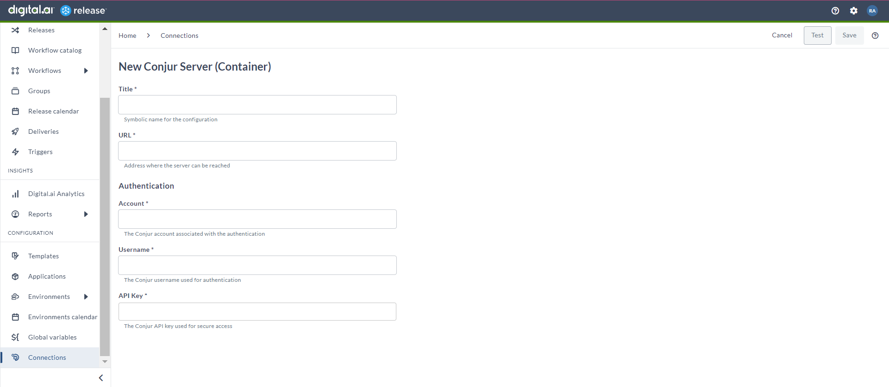
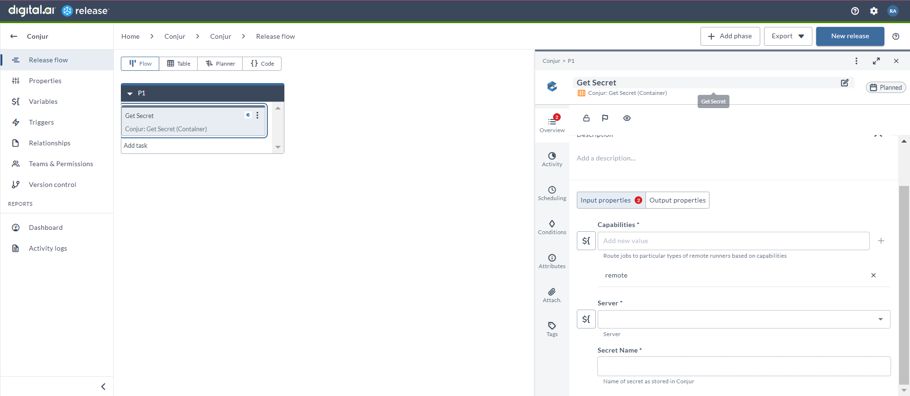

# Manage your Conjur Secrets

### Before you begin
This how-to involves working with a variety of tools, such as Digital.ai Release and Conjur. You can perform this task by following the instructions. However, being familiar with these tools and technologies can significantly help you when you try them out in your test environment.

### What's the objective?
The objective is to interact with Conjur Secret Service using Digital.ai Release.

### What do you need?
* A Linux or Windows server (with root and Internet access) that has Digital.ai Release version 24.1.0 (or later) installed
* Remote runner setup for Digital.ai Release
* Conjur integration for Digital.ai Release

### What do you have?
* Conjur environment and credentials

### How does it work?
* The Conjur integration allows you to interact with the Secret Service more seamlessly.

## Set up Conjur Configuration

1. From the navigation pane, under **CONFIGURATION**, click **Connections**.
2. Under **Secrets management**, next to **Conjur Server (Container)**, click add button. 
The **New Conjur Server (Container)** page opens. 
1. In the **Title** field, enter the name of the configuration. 
This name will display in Conjur tasks.
1. In the **URL** field, enter the URL to access the Conjur server.
2. In the **Account** field, enter the Conjur account associated with the authentication.
3. In the **Username** field, enter the Conjur username used for authentication.
4. In the **API Key** field, enter the Conjur API key used for secure access.
5. To test the connection, click **Test**.
6. To save the configuration, click **Save**.

## Get Secret (Container)

The _Get Secret (Container)_ task is used to retrieve sensitive information or secrets securely from the Conjur platform during the deployment or release process.

1. In the release flow tab of a Release template, add a task of type **Conjur** > **Get Secret (Container)**.
2. Click the added task to open it.
3. In the **Capabilities** field, enter a value that matches the capability set for your remote runner.
This will help you to route jobs to that particular remote runner.
1. In the **Server** field, select the Conjur server configured.
2. In the **Secret Name** field, enter the name of the secret as it is stored in Conjur.

