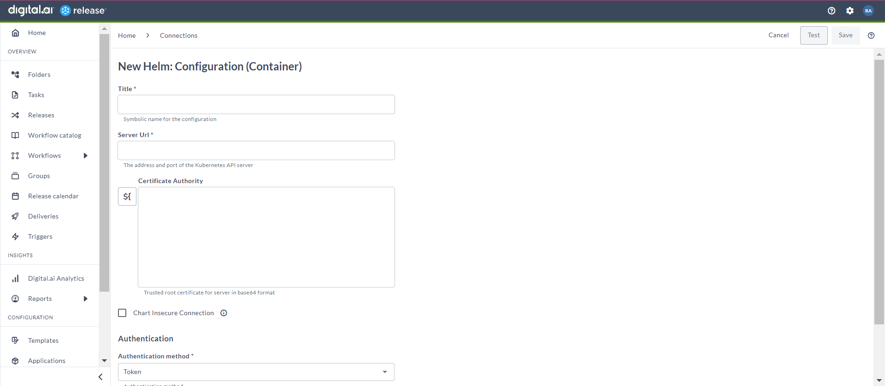
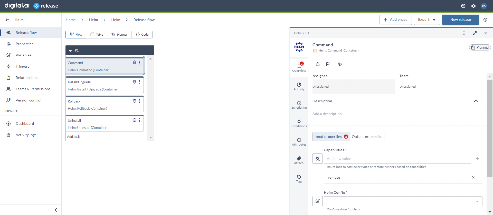
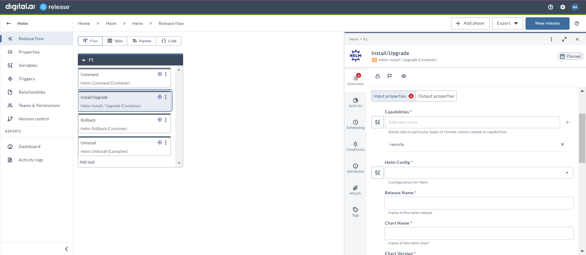
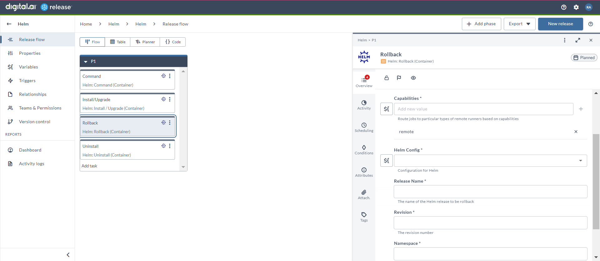
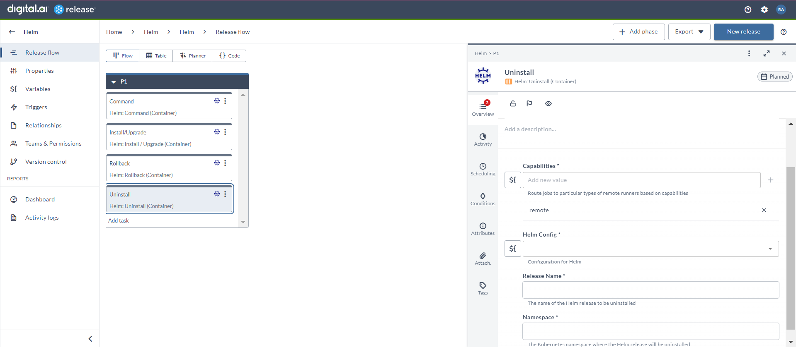

# Manage your application in kubernetes using Helm

### Before you begin
This how-to involves working with a variety of tools, such as Digital.ai Release and Helm. You can perform this task by following the instructions. However, being familiar with these tools and technologies can significantly help you when you try them out in your test environment.

### What's the objective?
The objective is to efficiently install, uninstall, and roll back the deployment of your application using two primary tools: Digital.ai Release and Helm

### What do you need?
* A Linux or Windows server (with root and Internet access) that has Digital.ai Release version 24.1.0 (or later) installed
* Remote runner setup for Digital.ai Release
* Helm integration for Digital.ai Release

### What do you have?
* Kubernetes cluster and credentials

### How does it work?
The Helm integration is based on your inputs to install, uninstall, upgrade, and rollback the applications in Kubernetes.

## Set up Helm Configuration

1. From the navigation pane, under **CONFIGURATION**, click **Connections**.
2. Under **HTTP Server connections**, next to **Helm: Configuration (Container)**, click add button. 
The **New Helm: Configuration (Container)** page opens. 
1. In the **Title** field, enter the name of the configuration. 
This name will display in Helm tasks.
1. In the **Server URL** field, enter the URL of the Kubernetes API server.
2. In the **Certificate Authority** field, enter the trusted root certificate for server in base64 format.
Alternatively, you can create a variable and use it here.
3. If you select the **Chart Insecure Connection** checkbox, it will skip the TLS certification check when you download the helm chart.
4. Two authentication methods available, do one of the following:
   * Token
   * ConfigFile
5. To test the connection, click **Test**.
6. To save the configuration, click **Save**.

## Command (Container)

The _Command (Container)_ task is used to run the helm commands to manage your helm charts.

1. In the release flow tab of a Release template, add a task of type **Helm** > **Command (Container)**.
2. Click the added task to open it.
3. In the **Capabilities** field, enter a value that matches the capability set for your remote runner.
This will help you to route jobs to that particular remote runner.
1. In the **Helm Config** field, select the Helm configuration.
2. In the **Command** field, enter the helm command that you want to run to manage your helm charts.
3. Switch on the **Output Json** toggle, if your helm command supports the --output flag.

## Install/Upgrade (Container)

The _Install/Upgrade (Container)_ task is used to install or upgrade your helm charts.

1. In the release flow tab of a Release template, add a task of type **Helm** > **Install/Upgrade (Container)**.
2. Click the added task to open it.
3. In the **Capabilities** field, enter a value that matches the capability set for your remote runner.
This will help you to route jobs to that particular remote runner. 
4. In the **Helm Config** field, select the Helm configuration.
5. In the **Release Name** field, enter the name of the Helm release.
6. In the **Chart Name** field, enter the name of the Helm chart.
7. In the **Chart Version** field, enter the version of the Helm chart.
8. In the **Namespace** field, enter the Kubernetes namespace where you will install or upgrade the Helm chart.
9. In the **Repository URL** field, enter the URL of the Helm chart repository.
10. In the **Username** field, enter the username to access your Helm chart repository.
11. In the **Password** field, enter the password to access your Helm chart repository.
12. You can switch on the **Dry Run with Client** toggle to simulate an installation with the client.
13. You can switch on the **Dry Run with Server** toggle to simulate an installation with the server.
14. In the **Command Flags** field, you can add some additional commands that you want to add in your Helm command.
15. You can use the _Input variables_ table to create some key-value pairs as input variables to be used in the Helm configuration.

## Rollback (Container)

The _Rollback (Container)_ task is used to roll back your helm charts.

1. In the release flow tab of a Release template, add a task of type **Helm** > **Command (Container)**.
2. Click the added task to open it.
3. In the **Capabilities** field, enter a value that matches the capability set for your remote runner.
This will help you to route jobs to that particular remote runner.
4. In the **Helm Config** field, select the Helm configuration.
5. In the **Release Name** field, enter the name of the Helm release that you want to roll back.
6. In the **Revision** field, enter the revision number of the Helm chart that you want to roll back.
7. In the **Namespace** field, enter the Kubernetes namespace from where the Helm chart will be rolled back.
8. In the **Command Flags** field, you can add some additional commands that you want to add in your Helm command.

## Uninstall (Container)

The _Uninstall (Container)_ task is used to uninstall your helm charts.

1. In the release flow tab of a Release template, add a task of type **Helm** > **Command (Container)**.
2. Click the added task to open it.
3. In the **Capabilities** field, enter a value that matches the capability set for your remote runner.
This will help you to route jobs to that particular remote runner.
4. In the **Helm Config** field, select the Helm configuration.
5. In the **Release Name** field, enter the name of the Helm release that you want to uninstall.
6. In the **Namespace** field, enter the Kubernetes namespace from where the Helm chart will be uninstalled.

