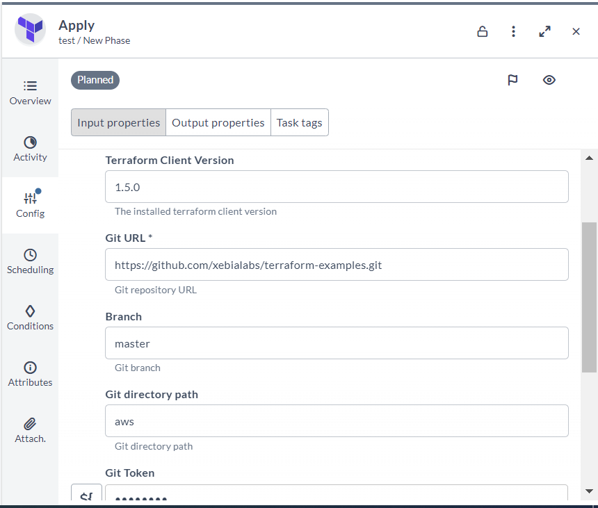
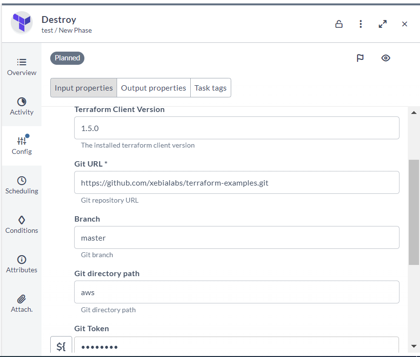

# Manage cloud infrastructure using Terraform

### Before you begin
This how-to involves working with a variety of tools, such as Digital.ai Release and Terraform. You can perform this task by following the instructions. However, being familiar with these tools and technologies can significantly help you when you try them out in your test environment.

### What's the objective?
The objective is to efficiently oversee and control the cloud infrastructure utilizing two primary tools, Digital.ai Release and the Terraform.

### What do you need?
* A Linux or Windows server (with root and Internet access) that has Digital.ai Release version 23.3.0 (or later) installed
* Remote runner setup for Digital.ai Release
* Terraform integration for Digital.ai Release

### What do you have?
* Git repository containing Terraform configuration files

### How does it work?
The Terraform integration streamlines the deployment process through its native Terraform client. This integrated functionality facilitates the cloning of your Git repository, enabling seamless access to your Terraform configuration files. Subsequently, it automates the execution of the apply or destroy command, thereby expediting the provisioning or dismantling of your infrastructure as specified in the configuration.

### Terraform: Apply and Destroy (Container) Task

**Apply task :** It is to execute the Terraform module using the 'apply' command

**Destroy task :** It is to execute the Terraform module using the 'destroy' command

### Task Inputs

The Terraform Apply and Destroy tasks are accepts the following inputs:

1. **Git URL:** The URL of the Git repository containing your Terraform configuration files.
2. **Git branch:** The Git branch to check out from the repository.
3. **Git directory path:** The directory path within the Git repository where your Terraform configuration files are located.
4. **Git Token:** The Git access token used for authentication to access the repository.
5. **Environment Variables:** Additional environment variables that your Terraform configuration may require. Pass terraform environment variables the following format: {'VAR1': 'value1', 'VAR2': 'value2'}
6. **Example for AWS Environment Variables** : {'AWS_ACCESS_KEY_ID': 'Your value', 'AWS_SECRET_ACCESS_KEY': 'Your value', 'AWS_SESSION_TOKEN': 'Your value'}
### Task Outputs

**Output Variables:** Return variables and values for a Terraform module

### Task Screenshots

