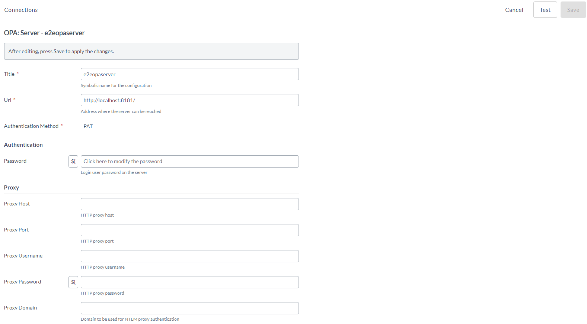
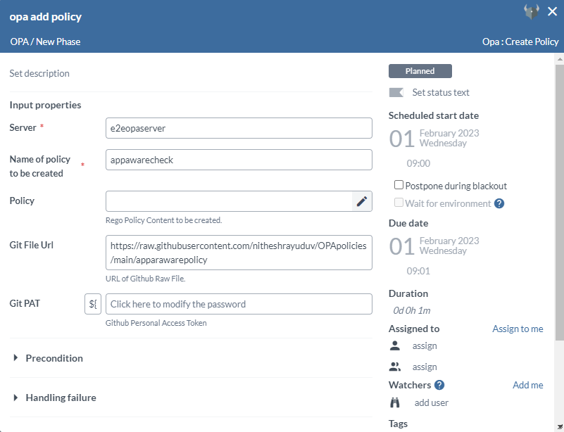
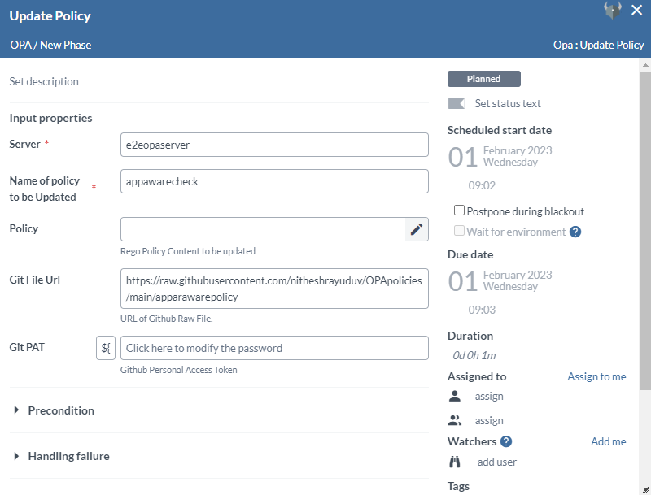

Open Policy Agent (OPA) is a freely available engine that enables you to write policies in the form of code and incorporate them into your application or process. The Release [OPA Integration](https://www.openpolicyagent.org/) enables Release to work with Open Policy Agent server to manage policies and to evaluate inputs based on policy language known as REGO, which allows you to write policies for various services utilizing the same language.

**Important:** You must set up a connection to the OPA server before adding OPA tasks.

## Features

OPA provides the following features:

* Create, Update, Delete, and Get an OPA policy.
* Evaluate an input against an OPA policy.
* Parse GitHub Actions Log and Jenkins Build Log for Application Security. 

## Requirements

The OPA integration requires the following:

* OPA server running and accessible via HTTP(s).
* Access credentials to the GitHub storage repo which is used to store the policies.

## Set up a connection to an OPA server

To set up a connection to an OPA server:

1. From the navigation pane, under **Configuration**, click **Connections**.
1. Under **HTTP Server connections**, next to **OPA: Server**, click add button.
1. In the **Title** field, enter a name for the configuration.
1. In the **URL** field, enter the address of the server.
1. If required, enter authentication details and proxy details.
1. To test the connection, click **Test**.
1. To save the configuration, click **Save**.

## Add Create Policy task

The _Create Policy_ task creates a policy in the OPA server.

1. In the release flow tab of a Release template, add a task of type **OPA** > **Create Policy**.
2. Click the added task to open it.
3. In the **Server** field, select the configured OPA server.
4. In the **Name of policy to be created** field, add the policy name.
5. For policy that is a string, paste the policy in the **Policy** field.
6. To fetch the policy as a code from the GitHub repository, add the URL of GitHub raw file in the **Git File Url** field, and the GitHub PAT in the **Git PAT** field.

## Add a Update Policy task

The Update Policy task updates a policy in the OPA server.

To add a Update Policy task:

1. In the release flow tab of a Release template, add a task of type **OPA** > **Update Policy**.
1. Click the added task to open it.
1. In the **Server** field, select the configured OPA server.
1. In the **Name of policy to be Updated** field, add the policy name.
1. For Policy as a String, paste the policy in the **Policy** field. Or to fetch Policy as a Code from GitHub Repository, add the URL of GitHub raw file in the **Git File Url** field, and the GitHub PAT in **Git PAT** field.

## Add a Get Policy task

The Get Policy task gets a policy from the OPA server.

To add a Get Policy task:

1. In the release flow tab of a Release template, add a task of type **OPA** > **Get Policy**.
1. Click the added task to open it.
1. In the **Server** field, select the configured OPA server.
1. In the **Name of policy** field, add the policy name.
1. The policy will be stored in the output **Policy** field.

## Add a Delete Policy task

Delete Policy task deletes a policy from the OPA server.

To add a Delete Policy task:

1. In the release flow tab of a Release template, add a task of type **OPA** > **Delete Policy**.
1. Click the added task to open it.
1. In the **Server** field, select the configured OPA server.
1. In the **Name of policy** field, add the policy name.

## Add a Evaluate Policy task

Evaluate Policy task evaluates an input against a policy in the OPA server.

To add a Evaluate Policy task:

1. In the release flow tab of a Release template, add a task of type **OPA** > **Evaluate Policy**.
1. Click the added task to open it.
1. In the **Server** field, select the configured OPA server.
1. In the **Json Input For Evaluation** field, add the input which will be evaluated against the policy.
1. In the **Name of policy to Check with** field.
1. In the **Expected Output** field, the expected output will be checked with the actual policy check result.

## Add a Evaluate Policy task

Evaluate Policy task evaluates an input against a policy in the OPA server.

To add a Evaluate Policy task:

1. In the release flow tab of a Release template, add a task of type **OPA** > **Evaluate Policy**.
1. Click the added task to open it.
1. In the **Server** field, select the configured OPA server.
1. In the **Json Input For Evaluation** field, add the input which will be evaluated against the policy.
1. In the **Name of policy to Check with** field.
1. In the **Expected Output** field, the expected output will be checked with the actual policy check result.

## Add a Parse GitHub Actions Log task

To download and parse GitHub actions log task from an Application Security Job.
Note: Only works with Application Security Log.

To add a parse GitHub actions log task:

1. In the release flow tab of a Release template, add a task of type **OPA** > **Parse GitHub Actions Log**.
1. Click the added task to open it.
1. In the **Server** field, select the configured OPA server.
1. In the **Application Type** field, select **Android** or **Ios**.
1. In the **Base url** field, enter the GitHub api, for example "https://api.github.com".
1. In the **Username** field, enter the GitHub username.
1. In the **Git PAT** field, enter the GitHub PAT.
1. In the **Repository Name** field, enter the GitHub repository name.
1. In the **Workflow Run ID** field, enter the GitHub Actions workflow ID.
1. In the **Json Input** output properties field, the output will be assigned to the variable assigned in this field.
   Note: The output variable can be used for further evaluation as an input.

## Add a Parse Jenkins Log task

To download and parse Jenkins log task from an Application Security Job.
Note: Only works with Application Security Log.

To add a parse Jenkins log task:

1. In the release flow tab of a Release template, add a task of type **OPA** > **Parse GitHub Actions Log**.
1. Click the added task to open it.
1. In the **Server** field, select the configured OPA server.
1. In the **Application Type** field, select **Android** or **Ios**.
1. In the **Jenkins Server** field, select the configured Jenkins server.
1. In the **Username** field, enter the Jenkins username.
1. In the **Password** field, enter the Jenkins password, or else use the Token field.
1. In the **API Token** field, enter the Jenkins token, or else use the Password.
1. In the **Job Url** field, enter the Jenkins job URL.
1. In the **Json Input** output properties field, the output will be assigned to the variable assigned in this field.
   Note: The output variable can be used for further evaluation as an input.

## How to Create an Application Security Evaluation task with OPA - DevSecOps

### Prerequisites

* OPA server running and accessible.
* Opa policies in GitHub repository and with its required permissions and credentials.
* Application Security run in Jenkins/GitHub actions with its required permissions and credentials.

To Create an Application Security Evaluation task with OPA:

1. Create the required policies following the above mentioned steps in **Add Create Policy task** and starting the release.
1. Create the required task for parsing GitHub actions logs following the **Add a Parse GitHub Actions Log task** steps.
1. Create the required Evaluation template with required policy name and input following the above mentioned steps in **Add a Evaluate Policy task**.
1. Add other required tasks.
1. Create and Start the release for Evaluating based on the evaluation add further required tasks.

