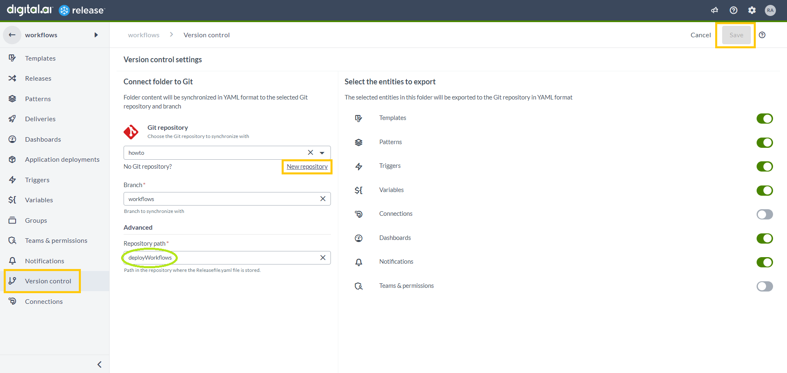
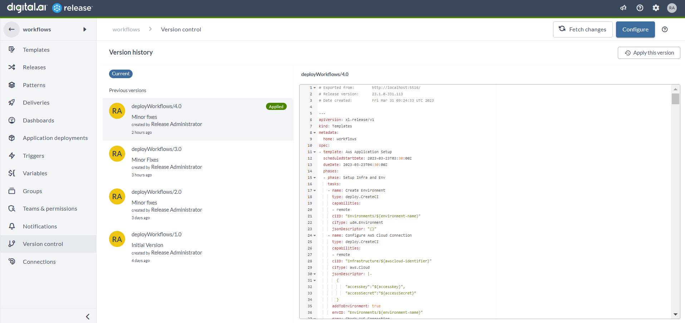
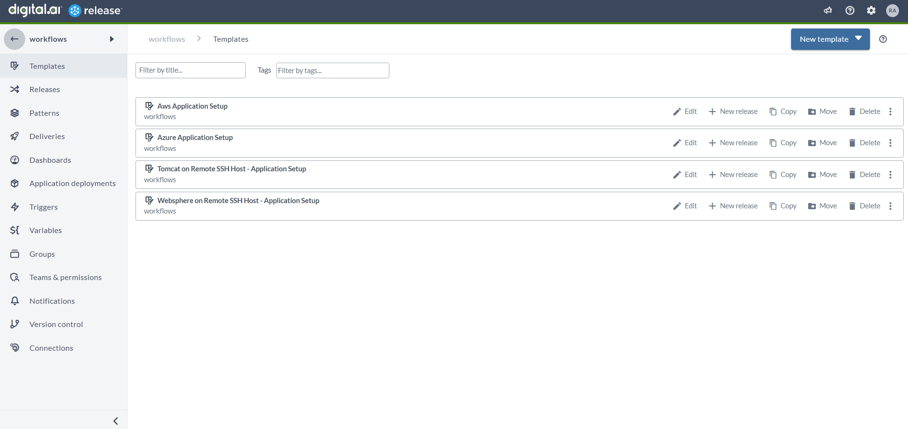

# Release Workflows

Use Release workflows to quickly onboard on Release and Deploy. Use these workflows to interactively setup cloud native and legacy applications in Deploy in no time.

## Prerequisites

1. Digital.ai Release with remote runner setup. [guide](https://github.com/xebialabs/xlr-remote-runner/wiki/)
2. Ensure required plugins are installed.
	1. xlr-xld-remote-integration [image not available in public repository yet]
3. Digital.ai Deploy setup with the plugins as required.
	1. xld-aws-plugin
	2. xld-azure-plugin
	3. xld-google-cloud-compute-plugin
	4. tomcat-plugin
	5. was-plugin
4. Enable the stepper feature flag to run workflows in interactive mode. [pending documentation]

## Setting up Workflows

Fork this [repository](https://github.com/xebialabs-community/howto)

In Digital.ai Release, 
1. Create a new folder.
2. From within the folder, in the left pane, select 'Version control'.
3. Click on Configure button on the top left.
4. Under Git Repository, click on the New Repository link.
5. Create a new connection by specifying the details of the Forked Repository.
6. Specify the branch and specify the Repository path as 'workflows' and save.

7. Select the latest version displayed and click 'Apply this version'.

8. The workflow templates are populated in the Templates section.

### Running Workflows

1. Click on the specific template.
2. Click on the 'New Release' button.
3. Fillout the required field values.
4. Add a stepper tag in the bottom right section and click 'Create'.
5. In the url, replace releases with stepper and load the page.
... To be filled once validated
